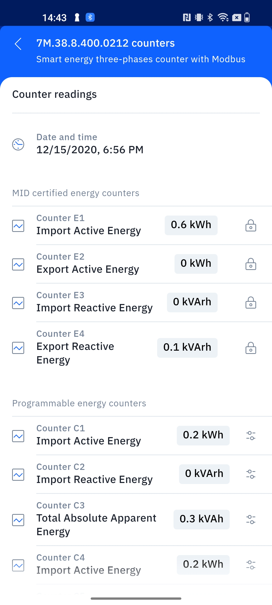

## Panoramica

Nei tutorial precedenti abbiamo mostrato [come utilizzare il Finder Opta per
leggere da un contatore di energia Finder serie
7M](https://github.com/dndg/FinderOpta7MTutorial/blob/main/content-it.md) e
[come configurarlo per far si che agisca da Peripheral
BLE](https://github.com/dndg/FinderOptaBLEPeripheralTutorial/blob/main/content-it.md).
In questo tutorial, mostreremo invece come pubblicare via BLE il contenuto
della lettura di un contatore del Finder serie 7M, utilizzando un Service BLE
su Finder Opta. In particolare, questo Service avrà due Characteristic,
rispettivamente per la mantissa e l'esponente dell'Energia Attiva Importata
misurata dal Finder serie 7M.

## Obiettivi

* Imparare a creare un Service BLE con multiple Characteristic in sola lettura
  sul Finder Opta.
* Imparare a utilizzare le funzionalità BLE del Finder Opta per trasmettere il
  valore di un contatore certificato MID del Finder serie 7M.

## Requisiti hardware e software

### Requisiti hardware

* PLC Finder Opta con supporto RS-485 (x1).
* Contatore di energia Finder serie 7M (x1).
* Alimentatore DIN rail 12VDC/1A (x1).
* Cavo USB-C® (x1).
* Cavo per la connettività RS-485 con una delle seguenti specifiche (x2):
  * STP/UTP 24-18AWG (non terminato) con impedenza di 100-130Ω.
  * STP/UTP 22-16AWG (terminato) con impedenza di 100-130Ω.

### Requisiti Software

* [Arduino IDE 1.8.10+](https://www.arduino.cc/en/software), [Arduino IDE
 2.0+](https://www.arduino.cc/en/software) o [Arduino Web
 Editor](https://create.arduino.cc/editor).
* Se si utilizza Arduino IDE offline, è necessario installare la libreria
  `ArduinoBLE` utilizzando il Library Manager dell'Arduino IDE. Inoltre,
  bisognerà installare la libreria `Finder 7M per Finder Opta`: è possibile
  clonarla [da GitHub](https://github.com/dndg/Finder7M) direttamente nella
  directory contenente tutte le altre librerie.
* [Codice di esempio](assets/FinderOptaBLE7MExample.zip).

## Finder Opta e il BLE

Grazie alla libreria `ArduinoBLE`, Finder Opta può comportarsi come Peripheral
BLE e configurare Service con una o più Characteristic in modalità di sola
lettura, in modo da pubblicare dati che un Central può leggere una volta
connesso al Finder Opta.

## Istruzioni

### Configurazione dell'Arduino IDE

Per seguire questo tutorial, sarà necessaria [l'ultima versione dell'Arduino
IDE](https://www.arduino.cc/en/software). Se è la prima volta che configuri il
Finder Opta, dai un'occhiata al tutorial [Getting Started with
Opta](/tutorials/opta/getting-started).

Assicurati di installare l'ultima versione delle librerie
[`ArduinoBLE`](https://www.arduino.cc/reference/en/libraries/arduinoble/)
poiché verrà utilizzata per la comunicazione BLE con il Central.

Infine, per installare la libreria `Finder 7M for Finder Opta`, puoi clonarla
[da GitHub](https://github.com/dndg/Finder7M) e quindi spostarla nella cartella
_libraries_ all'interno del tuo sketchbook. Per ulteriori dettagli su come
installare manualmente le librerie, consulta [questo
articolo](https://support.arduino.cc/hc/en-us/articles/5145457742236-Add-libraries-to-Arduino-IDE).

### Connessione tra Finder Opta e Finder serie 7M

Come [nel tutorial
precedente](https://github.com/dndg/FinderOpta7MTutorial/blob/main/content-it.md#connessione-tra-finder-opta-e-finder-serie-7m),
dovremo alimentare i Finder Opta con l'alimentatore da 12VDC/1A e collegarlo al
7M tramite una connessione seriale RS-485. Per completare questi passaggi,
consulta il diagramma in figura:


Per far funzionare il codice di esempio, è necessario configurare i seguenti
parametri di comunicazione dei Finder serie 7M:

* Indirizzo Modbus `20`.
* Baudrate `38400`.
* Configurazione seriale `8-N-1`.

Ciò può essere fatto con facilità con il tuo smartphone utilizzando
[l'applicazione Finder
Toolbox](https://www.findernet.com/it/italia/supporto/software-e-app/) tramite
NFC.

### Panoramica del codice

Lo scopo del seguente esempio è configurare Finder Opta come Peripheral BLE,
creando poi due Characteristic in sola lettura a cui un Central possa accedere
per leggere mantissa ed esponente dell'Energia Attiva Importata misurata da un
Finder serie 7M connesso al Finder Opta tramite Modbus. In particolare,
configureremo un Service con due Characteristic al suo interno e avvieremo
l'advertising, attendendo che un Central si connetta: quando questo accadrà,
andremo a leggere il contatore certificato MID del Finder serie 7M che contiene
l'Energia Attiva Importata e restituiremo la misura all'interno delle
Characteristic.

#### Setup dello sketch

Nella parte iniziale dello sketch dichiariamo il Service e le Characteristic
BLE con i relativi UUID. Inoltre, le Characteristic saranno configurate in
modalità _read_:

```cpp
BLEService service7m("1915aec0-d36d-40cb-9a57-1617998202a1");
BLEIntCharacteristic inActiveMantissa("1915aec1-d36d-40cb-9a57-1617998202a1", BLERead);
BLEIntCharacteristic inActiveExponent("1915aec2-d36d-40cb-9a57-1617998202a1", BLERead);
```

In seguito creiamo un oggeto di tipo `Finder7M` proveniente dalla libreria
`Finder7M`, e definiamo la costante che contiene l'indirizzo Modbus del 7M da
cui vogliamo leggere:

```cpp
Finder7M f7m;
constexpr uint8_t MODBUS_7M_ADDRESS = 20;
```

Nell funzione di `setup()` andremo a configurare il nome del device usato
durante l'advertising, ed in seguito ad abbinare il Service e le
Characteristic, settandone anche il valore iniziale; al termine di queste
operazioni avvieremo l'advertising. Il codice della funzione è mostrato di
seguito:

```cpp
void setup()
{
    Serial.begin(9600);

    // Init the BLE service.
    if (BLE.begin() == 0)
    {
        while (1)
        {
        }
    }

    // Init the Finder7M.
    if (!f7m.init())
    {
        while (1)
        {
        }
    }

    // Set local name and service UUID.
    BLE.setLocalName("Finder Opta");
    BLE.setAdvertisedService(service7m);

    // Add service and characeristics.
    service7m.addCharacteristic(inActiveMantissa);
    service7m.addCharacteristic(inActiveExponent);
    BLE.addService(service7m);

    // Set initial value.
    inActiveMantissa.writeValue(0);
    inActiveExponent.writeValue(0);

    // Start advertising.
    BLE.advertise();
}
```

#### Loop principale

La funzione `loop()` di questo sketch rimane in ascolto in attesa di
connessioni da parte di Central, fino a quando non se ne connette uno: in caso
di connessione il Finder Opta leggerà il contatore certificato MID del Finder
serie 7M che contiene l'Energia Attiva Importata, restituendo mantissa ed
esponente all'interno delle due Characteristic. Il codice del loop principale è
il seguente:

```cpp
void loop()
{
    // Check if any central is available.
    BLEDevice central = BLE.central();
    if (central)
    {
        Serial.println("Central connected.");
        while (central.connected())
        {
            // As long as central is connected write to characeristics mantissa and exponent every second.
            Measure inActiveEnergy = f7m.getMIDInActiveEnergy(MODBUS_7M_ADDRESS);
            inActiveMantissa.writeValue(inActiveEnergy.mantissa());
            Serial.print("mantissa: " + String(inActiveEnergy.mantissa()));
            inActiveExponent.writeValue(inActiveEnergy.exponent());
            Serial.println(", exponent: " + String(inActiveEnergy.exponent()));
            delay(1000);
        }
        Serial.println("Central disconnected.");
    }
}
```

### Esempio di interazione

Una volta compilato e caricato lo sketch sul Finder Opta, è possibile
utilizzare l'app [nRF
Connect](https://www.nordicsemi.com/Products/Development-tools/nrf-connect-for-mobile)
per connettersi alla Peripheral BLE e leggere i valori dentro le
Characteristic. Al termine della scansione il Finder Opta comparirà tra i
dispositivi disponibili:


Procediamo connettendoci e vedremo apparire un Service e due Characteristic con
gli UUID assegnati dallo sketch alle Characteristic `inActiveMantissa` e
`inActiveExponent`. A questo punto clicchiamo sull'icona con freccia che punta
verso il basso per effetuare una lettura:


I valori letti segnalano un'Energia Attiva Importata di _6*10^2 wH = 600 wH =
0.6 kwH_. Leggiamo ora il Finder serie 7M tramite NFC con [l'applicazione
Finder
Tooolbox](https://www.findernet.com/en/worldwide/support/software-and-apps/)
per verificare di stare leggendo i valori corretti:



## Conclusioni

Questo tutorial mostra come configurare Finder Opta da Peripheral BLE, per
esporre due Characteristic in sola lettura da cui un Central possa leggere il
valore di Energia Attiva Importata contenuto nel contatore certificato MID di
un Finder serie 7M connesso al Finder Opta via Modbus.
