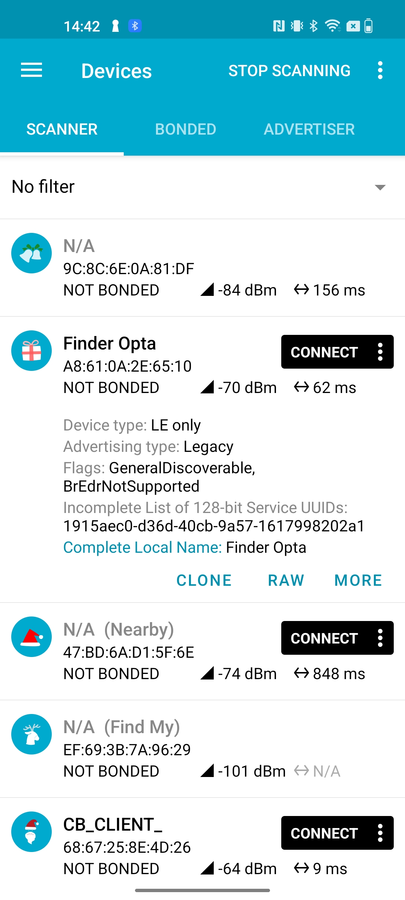
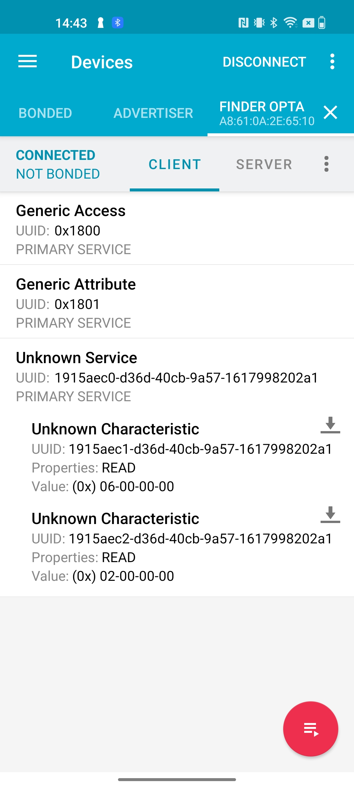
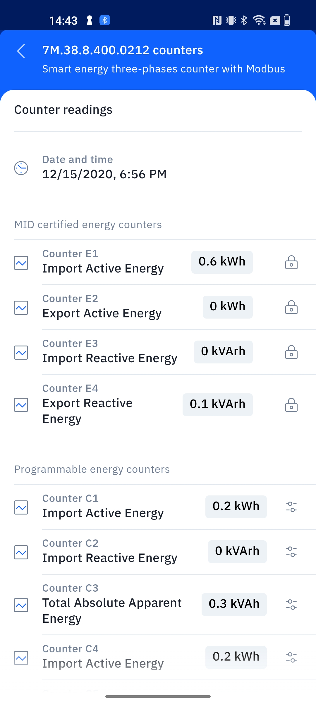

## Overview

In previous tutorials we showed [how to use the Finder Opta to read MID
counters from a Finder 7M energy
meter](https://github.com/dndg/FinderOpta7MTutorial/blob/main/content.md#connecting-the-finder-opta-and-finder-7m),
and also [how to use the device as BLE
Perpheral](https://github.com/dndg/FinderOptaBLEPeripheralTutorial). In this
tutorial we will instead show how to publish via BLE the content of a counter
read from the Finder 7M, using a dedicated BLE Service on the Finder Opta. In
particular, this Service is going to have two Characteristics, respectively for
the mantissa and the exponent of the Import Active Energy measured by the
Finder 7M energy meter.

## Goals

* Learn how to create a BLE Service with multiple read-only Characteristic on
  the Finder Opta.
* Learn how to take advanta ge of the BLE capabilities of the Finder Opta to
  transmit the value of a MID certified counter of the Finder 7M energy meter.

## Required Hardware and Software

### Hardware Requirements

* Finder Opta PLC with RS-485 support (x1).
* Finder 7M energy meter (x1).
* 12VDC/1A DIN rail power supply (x1).
* USB-C® cable (x1).
* Wire with either specification for RS-485 connection (x3):
  * STP/UTP 24-18AWG (Unterminated) 100-130Ω rated.
  * STP/UTP 22-16AWG (Terminated) 100-130Ω rated.

### Software Requirements

* [Arduino IDE 1.8.10+](https://www.arduino.cc/en/software), [Arduino IDE
2.0+](https://www.arduino.cc/en/software) or [Arduino Web
Editor](https://create.arduino.cc/editor).
* If you choose an offline Arduino IDE, you must install the `ArduinoBLE`
library. You can install it using the Library Manager of the Arduino IDE.
Additionally, you will need to install the `Finder 7M for Finder Opta library`:
you can clone it [from GitHub](https://github.com/dndg/Finder7M) directly into
the directory containing all the rest of your libraries.
* [Example code](assets/FinderOptaBLE7MExample.zip).

## Finder Opta and BLE

Using the `ArduinoBLE` library, the Finder Opta can act as BLE Peripheral and
configure Services with one or more Characteristic in read-only mode, allowing
it to publish data that a Central can read after connecting to the Finder Opta.

## Instructions

### Setting up the Arduino IDE

This tutorial will need [the latest version of the Arduino
IDE](https://www.arduino.cc/en/software). If it is your first time setting up
the Finder Opta, check out the [getting started
tutorial](/tutorials/opta/getting-started).

Make sure you install the latest version of the
[`ArduinoBLE`](https://www.arduino.cc/reference/en/libraries/arduinoble/)
library, as it will be used for BLE communication with the Central.

Finally, to install the `Finder 7M for Finder Opta library` you can clone it
[from GitHub](https://github.com/dndg/Finder7M) and then move it to the
libraries folder inside your sketchbook. For further details on how to manually
install libraries refer to [this
article](https://support.arduino.cc/hc/en-us/articles/5145457742236-Add-libraries-to-Arduino-IDE).

### Connecting the Finder Opta and Finder 7M

Just like [in the previous
tutorial](https://github.com/dndg/FinderOpta7MTutorial/blob/main/content.md#connecting-the-finder-opta-and-finder-7m)
we will need to power the Finder Opta with the 12VDC/1A supply and connect it
to the 7M via RS-485 serial connection. To complete these steps refer to the
following diagram:


For the example code to work, you will need to set the communication parameters
for the 7M energy meter to:

* Modbus address `20`.
* Baudrate `38400`.
* Serial configuration `8-N-1`.

This can easily be done with your smartphone using [the Finder Toolbox
application](https://www.findernet.com/en/worldwide/support/software-and-apps/)
via NFC.

### Code Overview

The goal of the following example is to configure the Finder Opta as BLE
Peripheral, in order to create two read-only Characteristics that a Central can
access to read the mantissa and the exponent of the Import Active Energy
measured by a Finder 7M energy meter connected to the Finder Opta via Modbus.
In particular, we will configure a Service with two Characteristics in it and
we will start advertising, waiting for a Central to connect: once it does, we
will read the MID certified counter of the Finder 7M that stores the Import
Active Energy, and we will return the measure inside the Characteristics.

#### Sketch setup

At the start of the sketch we declare the BLE Service and the Characteristics
with their relative UUIDs. Additionally, the Characteristics will be configured
in _read_ mode:

```cpp
BLEService service7m("1915aec0-d36d-40cb-9a57-1617998202a1");
BLEIntCharacteristic inActiveMantissa("1915aec1-d36d-40cb-9a57-1617998202a1", BLERead);
BLEIntCharacteristic inActiveExponent("1915aec2-d36d-40cb-9a57-1617998202a1", BLERead);
```

Next, we will create a `Finder7M` object taking advantage of the `Finder7M`
library, and we will define a constant containing the Modbus address of the
energy meter that we want to read from:

```cpp
Finder7M f7m;
constexpr uint8_t MODBUS_7M_ADDRESS = 20;
```

In the `setup()` function we will configure the advertised name of the device,
and then we will pair Service and Characteristics, also setting their initial
values; at the end of these operations we will start advertising. The code of
the function is shown below:

```cpp
void setup()
{
    Serial.begin(9600);

    // Init the BLE service.
    if (BLE.begin() == 0)
    {
        while (1)
        {
        }
    }

    // Init the Finder7M.
    if (!f7m.init())
    {
        while (1)
        {
        }
    }

    // Set local name and service UUID.
    BLE.setLocalName("Finder Opta");
    BLE.setAdvertisedService(service7m);

    // Add service and characeristics.
    service7m.addCharacteristic(inActiveMantissa);
    service7m.addCharacteristic(inActiveExponent);
    BLE.addService(service7m);

    // Set initial value.
    inActiveMantissa.writeValue(0);
    inActiveExponent.writeValue(0);

    // Start advertising.
    BLE.advertise();
}
```

#### Main loop

The `loop()` function of this sketch listens for connections by the Central,
until one is actually connected: at that point, the Finder Opta will read the
MID certified counter of the Finder 7M energy meter that contains the Import
Active Energy, and it will return its mantissa and exponent in two
Characteristics. The code of the main loop is attached below:

```cpp
void loop()
{
    // Check if any central is available.
    BLEDevice central = BLE.central();
    if (central)
    {
        Serial.println("Central connected.");
        while (central.connected())
        {
            // As long as central is connected write to characeristics mantissa and exponent every second.
            Measure inActiveEnergy = f7m.getMIDInActiveEnergy(MODBUS_7M_ADDRESS);
            inActiveMantissa.writeValue(inActiveEnergy.mantissa());
            Serial.print("mantissa: " + String(inActiveEnergy.mantissa()));
            inActiveExponent.writeValue(inActiveEnergy.exponent());
            Serial.println(", exponent: " + String(inActiveEnergy.exponent()));
            delay(1000);
        }
        Serial.println("Central disconnected.");
    }
}
```

### Interaction example

Once the sketch has been compiled and uploaded to the Finder Opta, we can use
the  [nRF
Connect](https://www.nordicsemi.com/Products/Development-tools/nrf-connect-for-mobile)
app to connect to the BLE Peripheral and read the values inside the
Characteristics.

At the end of a scan, the Finder Opta will appear among the available devices:



We then proceed by connecting to the device, after which we see a Service and
two Characteristic with UUIDs matching the ones assigned by the sketch to the
`inActiveMantissa` and `inActiveExponent` Characteristics. Let's now click on
the icons with the arrow pointing down in order to read the values:



The read values tell us that we have an Import Active Energy of _6*10^2 wH =
600 wH = 0.6 kwH_. Now we can read the Finder 7M energy meter via NFC using
[the Finder Toolbox
application](https://www.findernet.com/en/worldwide/support/software-and-apps/)
to check that we are reading a correct value:



## Conclusion

This tutorial shows how to configure the Finder Opta as BLE Peripheral, in
order to expose two read-only Characteristics from which a Central can read the
Import Active Energy stored in the MID certified counter of a Finder 7M energy
meter connected to the Finder Opta via Modbus.
